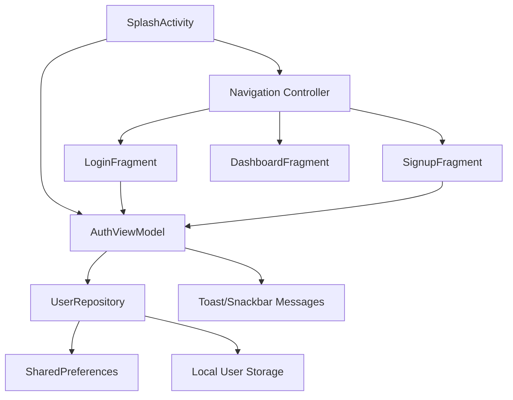
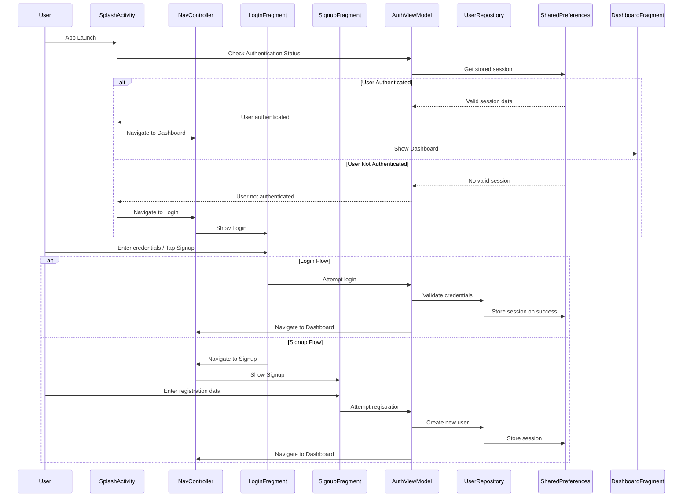

# Android Authentication Flow Design Document

## Overview

The Android Authentication Flow will provide secure user login, registration, and session management capabilities for the SugboAid Android application. The system will integrate seamlessly with the existing Android Navigation Component architecture, XML layouts, and Material Design system while maintaining consistency with the current app design.

## Architecture

### High-Level Architecture



### Authentication Flow Sequence



## Components and Interfaces

### 1. AuthViewModel

**Purpose**: Manages authentication state and business logic using Android ViewModel architecture

**Class Structure**:
```kotlin
class AuthViewModel(private val userRepository: UserRepository) : ViewModel() {
    
    private val _authState = MutableLiveData<AuthState>()
    val authState: LiveData<AuthState> = _authState
    
    private val _isLoading = MutableLiveData<Boolean>()
    val isLoading: LiveData<Boolean> = _isLoading
    
    private val _errorMessage = MutableLiveData<String?>()
    val errorMessage: LiveData<String?> = _errorMessage
    
    fun login(email: String, password: String)
    fun signup(name: String, email: String, password: String)
    fun logout()
    fun checkAuthenticationStatus(): Boolean
    fun validateEmail(email: String): Boolean
    fun validatePassword(password: String): Boolean
    fun validatePasswordMatch(password: String, confirmPassword: String): Boolean
}

data class AuthState(
    val isAuthenticated: Boolean = false,
    val user: User? = null
)

data class User(
    val id: String,
    val name: String,
    val email: String,
    val createdAt: Long,
    val lastLogin: Long? = null
)
```

### 2. UserRepository

**Purpose**: Handles user data operations and local storage management

**Class Structure**:
```kotlin
class UserRepository(private val context: Context) {
    
    private val sharedPreferences: SharedPreferences
    private val gson = Gson()
    
    fun saveUser(user: User): Boolean
    fun getUserByEmail(email: String): User?
    fun getAllUsers(): List<User>
    fun validateCredentials(email: String, password: String): User?
    fun saveSession(user: User): Boolean
    fun getStoredSession(): User?
    fun clearSession(): Boolean
    fun isEmailExists(email: String): Boolean
    
    companion object {
        private const val PREF_NAME = "sugboaid_auth"
        private const val KEY_USERS = "users"
        private const val KEY_CURRENT_USER = "current_user"
        private const val KEY_IS_LOGGED_IN = "is_logged_in"
        private const val KEY_LOGIN_TIMESTAMP = "login_timestamp"
    }
}
```

### 3. LoginFragment

**Purpose**: User interface for existing user authentication

**Layout Structure** (fragment_login.xml):
```xml
<?xml version="1.0" encoding="utf-8"?>
<ScrollView xmlns:android="http://schemas.android.com/apk/res/android"
    xmlns:app="http://schemas.android.com/apk/res-auto"
    android:layout_width="match_parent"
    android:layout_height="match_parent"
    android:background="@drawable/gradient_background">

    <LinearLayout
        android:layout_width="match_parent"
        android:layout_height="wrap_content"
        android:orientation="vertical"
        android:padding="24dp"
        android:gravity="center">

        <!-- App Logo -->
        <ImageView
            android:id="@+id/iv_app_logo"
            android:layout_width="120dp"
            android:layout_height="120dp"
            android:src="@drawable/app_logo"
            android:layout_marginBottom="32dp" />

        <!-- Login Card -->
        <com.google.android.material.card.MaterialCardView
            android:layout_width="match_parent"
            android:layout_height="wrap_content"
            app:cardCornerRadius="16dp"
            app:cardElevation="8dp"
            android:layout_marginBottom="16dp">

            <LinearLayout
                android:layout_width="match_parent"
                android:layout_height="wrap_content"
                android:orientation="vertical"
                android:padding="24dp">

                <!-- Title -->
                <TextView
                    android:layout_width="wrap_content"
                    android:layout_height="wrap_content"
                    android:text="Welcome Back"
                    android:textSize="24sp"
                    android:textStyle="bold"
                    android:layout_gravity="center"
                    android:layout_marginBottom="24dp" />

                <!-- Email Input -->
                <com.google.android.material.textfield.TextInputLayout
                    android:id="@+id/til_email"
                    android:layout_width="match_parent"
                    android:layout_height="wrap_content"
                    android:layout_marginBottom="16dp"
                    app:startIconDrawable="@drawable/ic_email">

                    <com.google.android.material.textfield.TextInputEditText
                        android:id="@+id/et_email"
                        android:layout_width="match_parent"
                        android:layout_height="wrap_content"
                        android:hint="Email"
                        android:inputType="textEmailAddress" />

                </com.google.android.material.textfield.TextInputLayout>

                <!-- Password Input -->
                <com.google.android.material.textfield.TextInputLayout
                    android:id="@+id/til_password"
                    android:layout_width="match_parent"
                    android:layout_height="wrap_content"
                    android:layout_marginBottom="24dp"
                    app:startIconDrawable="@drawable/ic_lock"
                    app:endIconMode="password_toggle">

                    <com.google.android.material.textfield.TextInputEditText
                        android:id="@+id/et_password"
                        android:layout_width="match_parent"
                        android:layout_height="wrap_content"
                        android:hint="Password"
                        android:inputType="textPassword" />

                </com.google.android.material.textfield.TextInputLayout>

                <!-- Login Button -->
                <com.google.android.material.button.MaterialButton
                    android:id="@+id/btn_login"
                    android:layout_width="match_parent"
                    android:layout_height="56dp"
                    android:text="Login"
                    android:textSize="16sp"
                    android:layout_marginBottom="16dp" />

                <!-- Signup Link -->
                <TextView
                    android:id="@+id/tv_signup_link"
                    android:layout_width="wrap_content"
                    android:layout_height="wrap_content"
                    android:text="Don't have an account? Sign up"
                    android:textColor="?attr/colorPrimary"
                    android:layout_gravity="center"
                    android:clickable="true"
                    android:focusable="true" />

            </LinearLayout>

        </com.google.android.material.card.MaterialCardView>

    </LinearLayout>

</ScrollView>
```

**Fragment Class Structure**:
```kotlin
class LoginFragment : Fragment() {
    
    private var _binding: FragmentLoginBinding? = null
    private val binding get() = _binding!!
    
    private lateinit var authViewModel: AuthViewModel
    private lateinit var navController: NavController
    
    override fun onCreateView(inflater: LayoutInflater, container: ViewGroup?, savedInstanceState: Bundle?): View
    override fun onViewCreated(view: View, savedInstanceState: Bundle?)
    override fun onDestroyView()
    
    private fun setupObservers()
    private fun setupClickListeners()
    private fun validateAndLogin()
    private fun navigateToSignup()
    private fun showError(message: String)
    private fun showLoading(isLoading: Boolean)
}
```

### 4. SignupFragment

**Purpose**: User interface for new user registration

**Layout Structure** (fragment_signup.xml):
```xml
<?xml version="1.0" encoding="utf-8"?>
<ScrollView xmlns:android="http://schemas.android.com/apk/res/android"
    xmlns:app="http://schemas.android.com/apk/res-auto"
    android:layout_width="match_parent"
    android:layout_height="match_parent"
    android:background="@drawable/gradient_background">

    <LinearLayout
        android:layout_width="match_parent"
        android:layout_height="wrap_content"
        android:orientation="vertical"
        android:padding="24dp"
        android:gravity="center">

        <!-- App Logo -->
        <ImageView
            android:id="@+id/iv_app_logo"
            android:layout_width="100dp"
            android:layout_height="100dp"
            android:src="@drawable/app_logo"
            android:layout_marginBottom="24dp" />

        <!-- Signup Card -->
        <com.google.android.material.card.MaterialCardView
            android:layout_width="match_parent"
            android:layout_height="wrap_content"
            app:cardCornerRadius="16dp"
            app:cardElevation="8dp">

            <LinearLayout
                android:layout_width="match_parent"
                android:layout_height="wrap_content"
                android:orientation="vertical"
                android:padding="24dp">

                <!-- Title -->
                <TextView
                    android:layout_width="wrap_content"
                    android:layout_height="wrap_content"
                    android:text="Create Account"
                    android:textSize="24sp"
                    android:textStyle="bold"
                    android:layout_gravity="center"
                    android:layout_marginBottom="24dp" />

                <!-- Name Input -->
                <com.google.android.material.textfield.TextInputLayout
                    android:id="@+id/til_name"
                    android:layout_width="match_parent"
                    android:layout_height="wrap_content"
                    android:layout_marginBottom="16dp"
                    app:startIconDrawable="@drawable/ic_person">

                    <com.google.android.material.textfield.TextInputEditText
                        android:id="@+id/et_name"
                        android:layout_width="match_parent"
                        android:layout_height="wrap_content"
                        android:hint="Full Name"
                        android:inputType="textPersonName" />

                </com.google.android.material.textfield.TextInputLayout>

                <!-- Email Input -->
                <com.google.android.material.textfield.TextInputLayout
                    android:id="@+id/til_email"
                    android:layout_width="match_parent"
                    android:layout_height="wrap_content"
                    android:layout_marginBottom="16dp"
                    app:startIconDrawable="@drawable/ic_email">

                    <com.google.android.material.textfield.TextInputEditText
                        android:id="@+id/et_email"
                        android:layout_width="match_parent"
                        android:layout_height="wrap_content"
                        android:hint="Email"
                        android:inputType="textEmailAddress" />

                </com.google.android.material.textfield.TextInputLayout>

                <!-- Password Input -->
                <com.google.android.material.textfield.TextInputLayout
                    android:id="@+id/til_password"
                    android:layout_width="match_parent"
                    android:layout_height="wrap_content"
                    android:layout_marginBottom="16dp"
                    app:startIconDrawable="@drawable/ic_lock"
                    app:endIconMode="password_toggle">

                    <com.google.android.material.textfield.TextInputEditText
                        android:id="@+id/et_password"
                        android:layout_width="match_parent"
                        android:layout_height="wrap_content"
                        android:hint="Password"
                        android:inputType="textPassword" />

                </com.google.android.material.textfield.TextInputLayout>

                <!-- Confirm Password Input -->
                <com.google.android.material.textfield.TextInputLayout
                    android:id="@+id/til_confirm_password"
                    android:layout_width="match_parent"
                    android:layout_height="wrap_content"
                    android:layout_marginBottom="24dp"
                    app:startIconDrawable="@drawable/ic_lock"
                    app:endIconMode="password_toggle">

                    <com.google.android.material.textfield.TextInputEditText
                        android:id="@+id/et_confirm_password"
                        android:layout_width="match_parent"
                        android:layout_height="wrap_content"
                        android:hint="Confirm Password"
                        android:inputType="textPassword" />

                </com.google.android.material.textfield.TextInputLayout>

                <!-- Signup Button -->
                <com.google.android.material.button.MaterialButton
                    android:id="@+id/btn_signup"
                    android:layout_width="match_parent"
                    android:layout_height="56dp"
                    android:text="Create Account"
                    android:textSize="16sp"
                    android:layout_marginBottom="16dp" />

                <!-- Login Link -->
                <TextView
                    android:id="@+id/tv_login_link"
                    android:layout_width="wrap_content"
                    android:layout_height="wrap_content"
                    android:text="Already have an account? Login"
                    android:textColor="?attr/colorPrimary"
                    android:layout_gravity="center"
                    android:clickable="true"
                    android:focusable="true" />

            </LinearLayout>

        </com.google.android.material.card.MaterialCardView>

    </LinearLayout>

</ScrollView>
```

### 5. Updated SplashActivity

**Purpose**: Enhanced splash screen with authentication-aware navigation

**Activity Structure**:
```kotlin
class SplashActivity : AppCompatActivity() {
    
    private lateinit var authViewModel: AuthViewModel
    
    override fun onCreate(savedInstanceState: Bundle?)
    
    private fun checkAuthenticationAndNavigate()
    private fun navigateToLogin()
    private fun navigateToDashboard()
    
    companion object {
        private const val SPLASH_DELAY = 2000L
    }
}
```

### 6. Navigation Graph Updates

**Updated nav_graph.xml**:
```xml
<?xml version="1.0" encoding="utf-8"?>
<navigation xmlns:android="http://schemas.android.com/apk/res/android"
    xmlns:app="http://schemas.android.com/apk/res-auto"
    xmlns:tools="http://schemas.android.com/tools"
    android:id="@+id/nav_graph"
    app:startDestination="@id/loginFragment">

    <!-- Login Fragment -->
    <fragment
        android:id="@+id/loginFragment"
        android:name="com.sugboaid.ui.auth.LoginFragment"
        android:label="Login"
        tools:layout="@layout/fragment_login">
        
        <action
            android:id="@+id/action_loginFragment_to_signupFragment"
            app:destination="@id/signupFragment"
            app:enterAnim="@anim/slide_in_right"
            app:exitAnim="@anim/slide_out_left" />
            
        <action
            android:id="@+id/action_loginFragment_to_dashboardFragment"
            app:destination="@id/dashboardFragment"
            app:popUpTo="@id/loginFragment"
            app:popUpToInclusive="true" />
            
    </fragment>

    <!-- Signup Fragment -->
    <fragment
        android:id="@+id/signupFragment"
        android:name="com.sugboaid.ui.auth.SignupFragment"
        android:label="Sign Up"
        tools:layout="@layout/fragment_signup">
        
        <action
            android:id="@+id/action_signupFragment_to_loginFragment"
            app:destination="@id/loginFragment"
            app:enterAnim="@anim/slide_in_left"
            app:exitAnim="@anim/slide_out_right" />
            
        <action
            android:id="@+id/action_signupFragment_to_dashboardFragment"
            app:destination="@id/dashboardFragment"
            app:popUpTo="@id/loginFragment"
            app:popUpToInclusive="true" />
            
    </fragment>

    <!-- Dashboard Fragment -->
    <fragment
        android:id="@+id/dashboardFragment"
        android:name="com.sugboaid.ui.dashboard.DashboardFragment"
        android:label="Dashboard"
        tools:layout="@layout/fragment_dashboard">
        
        <!-- Existing dashboard actions remain unchanged -->
        
    </fragment>

    <!-- Existing fragments (POS, Inventory, etc.) remain unchanged -->

</navigation>
```

## Data Models

### User Data Model
```kotlin
data class User(
    val id: String = UUID.randomUUID().toString(),
    val name: String,
    val email: String,
    val passwordHash: String,
    val createdAt: Long = System.currentTimeMillis(),
    val lastLogin: Long? = null
) {
    fun toJson(): String = Gson().toJson(this)
    
    companion object {
        fun fromJson(json: String): User = Gson().fromJson(json, User::class.java)
    }
}
```

### Session Data Model
```kotlin
data class UserSession(
    val userId: String,
    val email: String,
    val name: String,
    val loginTimestamp: Long,
    val isActive: Boolean = true
) {
    fun isExpired(): Boolean {
        val currentTime = System.currentTimeMillis()
        val sessionDuration = 24 * 60 * 60 * 1000L // 24 hours
        return (currentTime - loginTimestamp) > sessionDuration
    }
}
```

## Error Handling

### Validation Error Messages
```kotlin
object ValidationMessages {
    const val EMPTY_NAME = "Name is required"
    const val INVALID_NAME = "Name must be at least 2 characters"
    const val EMPTY_EMAIL = "Email is required"
    const val INVALID_EMAIL = "Please enter a valid email address"
    const val EMAIL_EXISTS = "An account with this email already exists"
    const val EMPTY_PASSWORD = "Password is required"
    const val WEAK_PASSWORD = "Password must be at least 6 characters"
    const val PASSWORD_MISMATCH = "Passwords do not match"
    const val INVALID_CREDENTIALS = "Invalid email or password"
    const val USER_NOT_FOUND = "No account found with this email"
    const val REGISTRATION_FAILED = "Registration failed. Please try again"
    const val LOGIN_FAILED = "Login failed. Please try again"
    const val LOGOUT_SUCCESS = "Logged out successfully"
}
```

### Error Handling Strategy
- Use TextInputLayout.setError() for field-specific validation errors
- Display Toast messages for general authentication errors
- Use Snackbar for success messages and actionable errors
- Implement proper loading states during async operations
- Handle network connectivity issues gracefully

## Testing Strategy

### Unit Testing Focus Areas

1. **AuthViewModel Testing**:
   - Authentication state management
   - Login/signup validation logic
   - Session management operations
   - Error handling scenarios

2. **UserRepository Testing**:
   - User data CRUD operations
   - SharedPreferences integration
   - Session persistence and retrieval
   - Email uniqueness validation

3. **Validation Logic Testing**:
   - Email format validation
   - Password strength requirements
   - Form field validation
   - Password confirmation matching

### Integration Testing

1. **Navigation Flow Testing**:
   - Splash → Login → Dashboard flow
   - Login → Signup → Dashboard flow
   - Logout → Login flow
   - Back navigation handling

2. **UI Integration Testing**:
   - Fragment lifecycle management
   - ViewModel-View data binding
   - Material Design component behavior
   - Theme compatibility testing

### Manual Testing Scenarios

1. **Authentication Flows**:
   - New user registration with valid data
   - Existing user login with correct credentials
   - Invalid login attempts
   - Session persistence across app restarts

2. **Form Validation**:
   - Empty field validation
   - Invalid email format handling
   - Password strength validation
   - Duplicate email registration

3. **UI/UX Testing**:
   - Dark/light theme compatibility
   - Responsive layout on different screen sizes
   - Loading states and error messages
   - Navigation animations and transitions

## Security Considerations

### Password Security
- Use Android's built-in password hashing utilities
- Implement minimum password length requirement (6 characters)
- Store only hashed passwords, never plain text
- Use secure TextInputLayout with password toggle

### Session Management
- Implement session expiration (24 hours)
- Clear sensitive data on logout
- Use encrypted SharedPreferences for sensitive data
- Validate session integrity on app startup

### Data Protection
- Input sanitization for all form fields
- SQL injection prevention (if using SQLite in future)
- Secure local storage practices
- Proper handling of authentication state

## Performance Considerations

### Optimization Strategies
- Lazy initialization of ViewModels
- Efficient SharedPreferences operations
- Proper Fragment lifecycle management
- Minimal database operations

### Memory Management
- Proper cleanup of ViewBinding references
- Efficient user data caching
- Avoid memory leaks in authentication observers
- Optimize image resources (app logo)

## Accessibility Features

### WCAG Compliance
- Proper content descriptions for all UI elements
- Support for TalkBack screen reader
- High contrast mode compatibility
- Touch target size compliance (48dp minimum)

### User Experience Enhancements
- Clear error messages and instructions
- Loading indicators for async operations
- Keyboard navigation support
- Focus management during form submission

## Theme Integration

### Material Design Integration
- Use existing color schemes and typography
- Implement proper Material Design elevation
- Support dynamic color theming (Android 12+)
- Consistent component styling across fragments

### Dark/Light Mode Support
- Automatic theme detection
- Proper contrast ratios in both modes
- Theme-aware drawable resources
- Smooth theme transition animations

## Implementation Phases

### Phase 1: Core Infrastructure
- AuthViewModel and UserRepository implementation
- Basic data models and validation logic
- SharedPreferences integration

### Phase 2: UI Components
- LoginFragment layout and logic
- SignupFragment layout and logic
- Form validation implementation

### Phase 3: Navigation Integration
- Navigation graph updates
- SplashActivity authentication logic
- Fragment transition animations

### Phase 4: Dashboard Integration
- Logout functionality in DashboardFragment
- Session management integration
- User profile display

### Phase 5: Testing and Polish
- Unit and integration testing
- UI/UX refinements
- Performance optimization
- Accessibility improvements