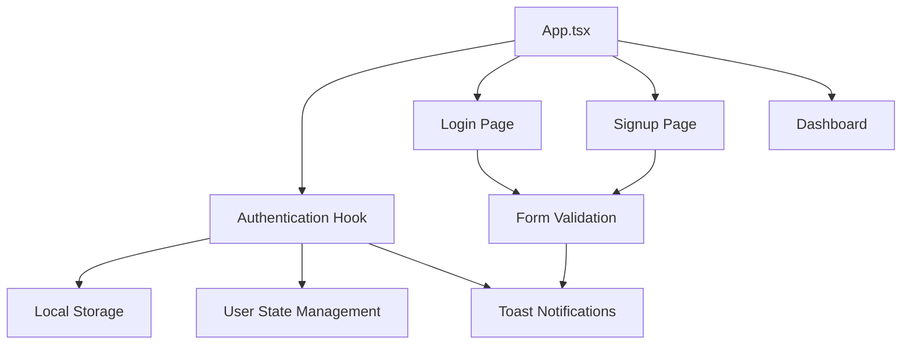
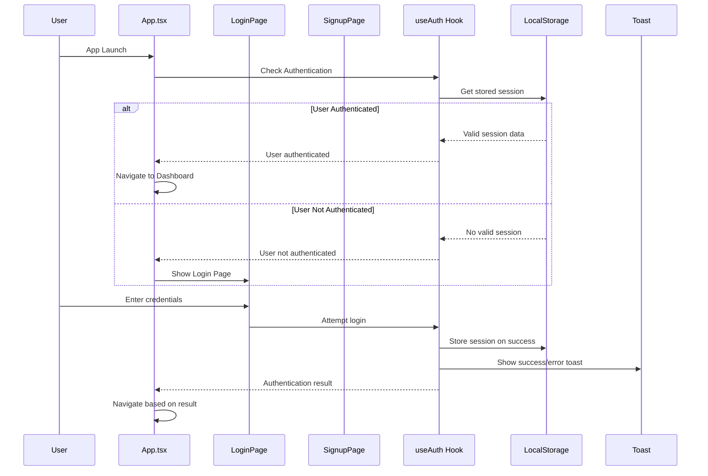

# Authentication System Design Document

## Overview

The Authentication System will provide secure user login, registration, and session management capabilities for the SugboAid application. The system will integrate seamlessly with the existing React + TypeScript architecture while maintaining the current design language and navigation patterns.

## Architecture

### High-Level Architecture



### Authentication Flow



## Components and Interfaces

### 1. Authentication Hook (useAuth)

**Purpose**: Centralized authentication state management and operations

**Interface**:
```typescript
interface User {
  id: string;
  name: string;
  email: string;
  createdAt: string;
}

interface AuthState {
  user: User | null;
  isAuthenticated: boolean;
  isLoading: boolean;
}

interface AuthActions {
  login: (email: string, password: string) => Promise<boolean>;
  signup: (name: string, email: string, password: string) => Promise<boolean>;
  logout: () => void;
  checkAuth: () => void;
}

interface UseAuthReturn extends AuthState, AuthActions {}
```

**Key Features**:
- Manages authentication state using React useState
- Provides login, signup, and logout functions
- Handles localStorage persistence
- Integrates with toast notifications
- Validates user credentials against stored users

### 2. LoginPage Component

**Purpose**: User interface for existing user authentication

**Design Elements**:
- Glassmorphic card design matching existing UI patterns
- Gradient background consistent with SplashScreen
- Form with email and password fields using existing Input components
- Login button using existing Button component
- Link to signup page
- Loading states and error handling
- Responsive layout for mobile and desktop

**Layout Structure**:
```
┌─────────────────────────────────────┐
│           Gradient Background        │
│  ┌─────────────────────────────┐    │
│  │      Glassmorphic Card      │    │
│  │  ┌─────────────────────┐    │    │
│  │  │    SugboAid Logo    │    │    │
│  │  └─────────────────────┘    │    │
│  │  ┌─────────────────────┐    │    │
│  │  │   Email Input       │    │    │
│  │  └─────────────────────┘    │    │
│  │  ┌─────────────────────┐    │    │
│  │  │   Password Input    │    │    │
│  │  └─────────────────────┘    │    │
│  │  ┌─────────────────────┐    │    │
│  │  │    Login Button     │    │    │
│  │  └─────────────────────┘    │    │
│  │  ┌─────────────────────┐    │    │
│  │  │  "Create Account"   │    │    │
│  │  │       Link          │    │    │
│  │  └─────────────────────┘    │    │
│  └─────────────────────────────┘    │
└─────────────────────────────────────┘
```

### 3. SignupPage Component

**Purpose**: User interface for new user registration

**Design Elements**:
- Similar glassmorphic design to LoginPage
- Form with name, email, password, and confirm password fields
- Registration button with loading states
- Link back to login page
- Form validation with real-time feedback
- Success handling with automatic navigation

**Validation Rules**:
- Name: Required, minimum 2 characters
- Email: Required, valid email format, unique check
- Password: Required, minimum 6 characters
- Confirm Password: Must match password field

### 4. Updated App.tsx Navigation

**Enhanced Screen Type**:
```typescript
type Screen =
  | "splash"
  | "login"
  | "signup"
  | "dashboard"
  | "pos"
  | "inventory"
  | "transparency"
  | "reports"
  | "notifications";
```

**Authentication-Aware Navigation Logic**:
- SplashScreen → Check authentication → Login/Dashboard
- Login successful → Dashboard
- Signup successful → Dashboard
- Logout → Login
- Protected screens redirect to Login if not authenticated

### 5. Dashboard Logout Integration

**Logout Button Placement**:
- Add logout option to existing dashboard interface
- Integrate with current dark mode toggle area
- Maintain existing design consistency
- Show user name/email in logout area

## Data Models

### User Model
```typescript
interface User {
  id: string;           // Unique identifier (UUID)
  name: string;         // Full name
  email: string;        // Email address (unique)
  password: string;     // Hashed password
  createdAt: string;    // ISO date string
  lastLogin?: string;   // ISO date string
}
```

### Session Model
```typescript
interface UserSession {
  user: User;
  token: string;        // Simple session token
  expiresAt: string;    // ISO date string
}
```

### Storage Structure
```typescript
// localStorage keys
const STORAGE_KEYS = {
  USERS: 'sugboaid_users',           // Array of User objects
  CURRENT_SESSION: 'sugboaid_session' // UserSession object
};
```

## Error Handling

### Authentication Errors
- **Invalid Credentials**: "Invalid email or password"
- **User Not Found**: "No account found with this email"
- **Email Already Exists**: "An account with this email already exists"
- **Weak Password**: "Password must be at least 6 characters"
- **Password Mismatch**: "Passwords do not match"
- **Network/Storage Errors**: "Something went wrong. Please try again."

### Error Display Strategy
- Use existing toast notification system
- Form field-level validation with inline error messages
- Loading states during authentication operations
- Graceful fallbacks for storage failures

## Testing Strategy

### Unit Testing Focus Areas
1. **useAuth Hook**:
   - Authentication state management
   - Login/signup/logout operations
   - localStorage integration
   - Error handling scenarios

2. **Form Validation**:
   - Email format validation
   - Password strength requirements
   - Confirm password matching
   - Required field validation

3. **Component Rendering**:
   - LoginPage form rendering
   - SignupPage form rendering
   - Conditional navigation logic
   - Loading and error states

### Integration Testing
1. **Authentication Flow**:
   - Complete signup → login → logout cycle
   - Session persistence across app restarts
   - Navigation between auth screens
   - Protected route access

2. **UI Integration**:
   - Theme compatibility (dark/light mode)
   - Toast notification integration
   - Responsive layout behavior
   - Accessibility compliance

### Manual Testing Scenarios
1. **User Registration**:
   - New user signup with valid data
   - Duplicate email registration attempt
   - Invalid form data submission
   - Password confirmation mismatch

2. **User Login**:
   - Valid credentials login
   - Invalid credentials attempt
   - Non-existent user login attempt
   - Session persistence verification

3. **Session Management**:
   - Automatic login on app restart
   - Logout functionality
   - Session expiration handling
   - Multiple user support

## Security Considerations

### Password Security
- Client-side password hashing using a simple hash function
- Minimum password length requirement (6 characters)
- No password storage in plain text

### Session Management
- Session tokens for user identification
- Session expiration (24 hours default)
- Automatic logout on session expiry
- Secure localStorage usage

### Data Validation
- Input sanitization for all form fields
- Email format validation
- XSS prevention through React's built-in protections
- CSRF protection through SPA architecture

## Performance Considerations

### Optimization Strategies
- Lazy loading of authentication components
- Efficient localStorage operations
- Minimal re-renders through proper state management
- Form validation debouncing

### Memory Management
- Proper cleanup of authentication state
- Event listener cleanup in useEffect hooks
- Efficient user data storage structure

## Accessibility Features

### WCAG Compliance
- Proper form labels and ARIA attributes
- Keyboard navigation support
- Screen reader compatibility
- High contrast mode support
- Focus management during navigation

### User Experience
- Clear error messages and instructions
- Loading indicators for async operations
- Responsive design for all screen sizes
- Touch-friendly interface elements

## Theme Integration

### Dark/Light Mode Support
- All authentication components support existing theme system
- Consistent color schemes with current design
- Proper contrast ratios in both modes
- Smooth theme transitions

### Design Consistency
- Reuse existing UI components (Button, Input, Card, Label)
- Maintain glassmorphic design language
- Consistent spacing and typography
- Gradient backgrounds matching SplashScreen

## Migration and Deployment

### Implementation Phases
1. **Phase 1**: Core authentication hook and data models
2. **Phase 2**: LoginPage and SignupPage components
3. **Phase 3**: App.tsx navigation integration
4. **Phase 4**: Dashboard logout integration
5. **Phase 5**: Testing and refinement

### Backward Compatibility
- No breaking changes to existing components
- Graceful handling of missing authentication data
- Fallback navigation for edge cases

### Data Migration
- Initialize empty user storage on first run
- Handle existing localStorage data gracefully
- Provide clear upgrade path for future enhancements